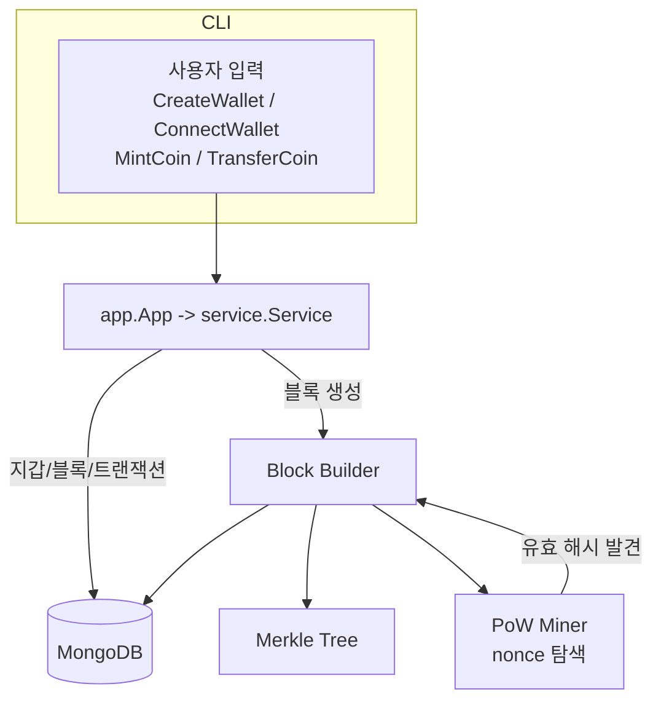

# go-blockchain-mining
간단한 **Proof of Work(PoW)** 기반 미니 블록체인 구현체.  
지갑 생성/조회, 코인 발행(Mint), 전송(Transfer)과 **블록 생성 + 채굴**(nonce 탐색), **머클 트리**를 포함한다.

> 학습을 목적으로, 초기 버전은 **“트랜잭션 1건 = 블록 1개”** 모델을 사용  
> 이후 멤풀 기반 **멀티 트랜잭션 블록**으로 확장 가능한 설계 목표
---
## 주요 기능
- **지갑**: ECDSA(P-256) 기반 키쌍 생성, 공개키(주소) 관리, 잔고 저장(MongoDB)
- **트랜잭션**: Mint / Transfer 생성 및 간단 검증(잔고 체크)
- **블록**: `PrevHash`, `MerkleRoot`, `Nonce`, `Height`, `Time` 등의 필드
- **PoW 채굴**: `SHA-256` 해시 타깃 미만이 되는 `nonce` 탐색
- **머클 트리**: 트랜잭션 집합으로 머클 루트 생성
---
## 아키텍처 개요



---
## 폴더 구조
```
app/            # CLI 진입, 입력 파싱, 유스케이스 라우팅
service/        # 블록/트랜잭션 생성, PoW, 머클트리
repository/     # 데이터베이스 읽기/쓰기 (MongoDB)
types/          # Block, Transaction, Wallet 등 데이터 구조체
config/         # 설정 로딩(예: Mongo URI)
global/         # 세션성 상태(현재 연결된 지갑 from 주소 등)
```

---
## 실행 방법

### 1) 요구 사항
- Go 1.25
- MongoDB (Atlas 또는 로컬)

### 2) 설치 & 실행
```bash
git clone https://github.com/<your-id>/go-blockchain-mining.git
cd go-blockchain-mining

# 환경변수 설정 env.toml
[mongo]
uri = <ConnectUri>
db = <DatabaseName>

[info]
version = "1"
difficulty = 2

# 실행 
go run .
```

---

## CLI 사용법
```
1. CreateWallet
2. ConnectWallet <PrivateKey>
3. ChangeWallet <PrivateKey>
4. TransferCoin <To> <Amount>
5. MintCoin <To> <Amount>
```

### 예시
```text
CreateWallet
# => PrivateKey=0x..., PublicKey=0x...

MintCoin 0x<to_public_key> 10000000
ConnectWallet 0x<your_private_key>
TransferCoin 0x<to_public_key> 5000
```

---

## 데이터 모델

### Block
```go
type Block struct {
  Time         int64
  Hash         string
  Transactions []*Transaction
  PrevHash     string
  Nonce        int64
  Height       int64
}
```

### Transaction
```go
type Transaction struct {
  Block   int64
  Time    int64
  From    string
  To      string
  Amount  string
  Message string    // "MintCoin", "TransferCoin"
  Tx      string    // signature
}
```

### Wallet
```go
type Wallet struct {
  PrivateKey string
  PublicKey  string
  Balance    string
  Time       uint64
}
```

---

## PoW 동작 방식
- 블록 헤더(PrevHash, MerkleRoot, Difficulty, Nonce)를 합쳐 `SHA-256` 해시
- 해시값이 **Target** 미만이면 유효
- `Target = 1 << (256 - difficulty)`

---

## 머클 트리
- 트랜잭션 바이트 배열 → 리프 노드
- 좌/우 노드 해시를 이어붙여 상위 노드 생성
- 리프가 홀수면 마지막 노드 복제하여 짝수 개로 맞춤
- 최종 루트 해시를 블록의 `MerkleRoot`로 사용

---

## 로드맵
- [ ] 멤풀 기반 멀티 트랜잭션 블록
- [ ] 코인베이스 트랜잭션 스펙 분리(보상+수수료)
- [ ] txid 추가, 머클 입력 표준화 등 트랜잭션 수정
- [ ] 계정 기반 Nonce 추가
- [ ] 난이도 조정 로직
- [ ] 트랜잭션 재적용 및 상태 복구 기능

---
## 수정사항
- nonce 순회 반복문 내부 로직 수정
  - 기존: 반복문 내부에서 트랜잭션들 해시 후 블록 해시 생성
    - 마이닝 중 트랜잭션 집합 및 순서가 바뀌면 안됨 
    - 매 반복마다 직렬화 + 머클트리 재계산함
  - 수정: 미리 머클트리를 계산해 고정한 후 nonce를 순회

---

[//]: # (## 보안/정합성 메모)

[//]: # (- 현재는 **문자열 직접 서명** → 권장: **직렬화 → 해시 → 서명**&#40;재현성/보안성 향상&#41;)

[//]: # (- **코인베이스 트랜잭션**은 별도 규칙 필요&#40;서명 불요 or 네트워크 정책&#41;)

[//]: # (- **Nonce 미구현** → 동일 Tx 재사용 가능성 존재)

[//]: # (- **머클 입력**은 `gob` 직렬화 → 권장: 표준 직렬화 & txid&#40;고정 길이 해시&#41; 기반)
